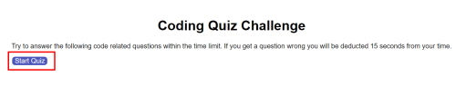
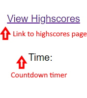
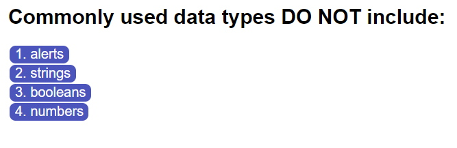
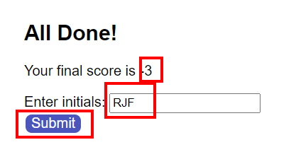
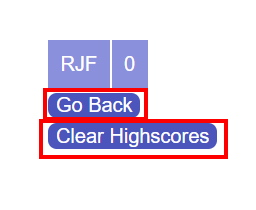

# code-quiz

# Code Quiz

## Description

My motivation with developing a JavaScript code quiz was so that I could give myself the opportunity to practice the JavaScript I have learnt so far, as it's been A LOT in a short space of time. 

I was able to practise my for loops, however it is definitely an area I need to work on as my functions were isolated rather then looping through the questions array in the questions.js file. This led to problems in that my code loops through each function as you proceed to the next question and provides incorrect answers over despite answering correctly. I attempted to correct this but too late into the timeline I had for this challenge and ended up not having enough time to resolve it properly by reworking my functions completely.

Due to this I left out the correct/incorrect feedback as displayed in the example as it would log the wrong information.

I got to practise click events and appending a document through JavaScript. I will say I found I encountered multiple hurdles in this challenge and hopefully as I progress and my understanding deepens, I may be able to revisit this and re-write the whole javasscript file so that it functions properly.

---

## Table of Contents (Optional)

- [Installation](#installation)
- [Usage](#usage)
- [Credits & Resources](#credits--resources)
- [Problems & Resolutions](#problems--resolutions)

---

## Installation

You are required to have a code editor such as VS Code if you want to clone/pull the repo. 

Aside from this the application should work on most browsers (except IE because well... you know).

---

## Usage

Please note I broke my JavaScript files into 3 different ones. My reasoning being it would allow me to make a cleaner code for those reading. The files are:
* logic.js - this contains the functionality of the quiz.
* questions.js - this contains the questions, answer options and correct answers.
* highscores.js - contains the small amount of functions needed for the highscores.html.
Unfortunately the issues with my functions in my logic meant this is not as clean as I would have liked.

To start the code quiz when the user clicks the "Start Quiz" button as shown in the image below. 
It is worth noting in the top LH corner there is a link to view the highscores page. In the top RH corner there is a timer element which doesn't start until the "Start Quiz" button is clicked. Once it is clicked it starts a countdown the length of the number of questions x 15 seconds/question.

Once the "Start Quiz" button is hit it is removed from the code via JS.

The application then runs through the questions. Whether the user answers correctly, or incorrectly they are taken to the question. If they answer incorrectly their time is docked 15 seconds. Answer outcome is logged in the console.

When the user finishes the quiz they are taken to the results page. This has been hidden via JS since the user has landed on the start page. The user will also be taken to this screen if their time runs out.

The quiz container is hidden once the results function is invoked. 

Their final score is displayed and they must enter their intials in the input area. These are then saved to local storage. *NOTE* The user must hit the "enter" key for their intitials to log.

Once the submit button is hit the user is taken to the highscores HTML. Their initials and score are retrieved from local storage and displayed. 

If the user clicks the "Go back" button they are taken back to the code quiz starting page. 
If the user clicks "Clear Highscore" their score/initials disappear from the page and are removed from local storage.

To view the deployed application just follow the link below!

* [https://rosemaryjf.github.io/code-quiz/](https://rosemaryjf.github.io/code-quiz/)

---

## Credits & Resources

I used the following online resources to try and educate myself on different aspects of the code I was writing. This is not an exhaustive list.

* [https://www.codegrepper.com/code-examples/java/create+a+button+using+javascript](https://www.codegrepper.com/code-examples/java/create+a+button+using+javascript)

* [https://developer.mozilla.org/en-US/docs/Web/HTML/Element/form](https://developer.mozilla.org/en-US/docs/Web/HTML/Element/form)

* [https://developer.mozilla.org/en-US/docs/Web/API/Storage/clear] (https://developer.mozilla.org/en-US/docs/Web/API/Storage/clear)

* [https://www.freecodecamp.org/news/html-button-onclick-javascript-click-event-tutorial/] (https://www.freecodecamp.org/news/html-button-onclick-javascript-click-event-tutorial/)

* [https://flexiple.com/javascript/javascript-exit-functions/] (https://flexiple.com/javascript/javascript-exit-functions/)

* [https://www.geeksforgeeks.org/javascript-nested-functions/] (https://www.geeksforgeeks.org/javascript-nested-functions/)

* [https://developer.mozilla.org/en-US/docs/Web/JavaScript/Guide/Functions] (https://developer.mozilla.org/en-US/docs/Web/JavaScript/Guide/Functions)

* [https://developer.mozilla.org/en-US/docs/Web/API/EventTarget/addEventListener] (https://developer.mozilla.org/en-US/docs/Web/API/EventTarget/addEventListener)

* [https://developer.mozilla.org/en-US/docs/Web/API/Element/click_event] (https://developer.mozilla.org/en-US/docs/Web/API/Element/click_event)

* [https://stackoverflow.com/questions/30342873/event-target-is-undefined-in-events] (https://stackoverflow.com/questions/30342873/event-target-is-undefined-in-events)

* [https://developer.mozilla.org/en-US/docs/Web/API/Event/target] (https://developer.mozilla.org/en-US/docs/Web/API/Event/target)

In addition to this I sought help to resolve some of my issues through Ask BCS and our teacher's assistant Doug. 

---

## Problems & Resolutions

I was encountering an issue in my for loop to fill the buttons in my HTML. The standout issues were:

* the syntax for the for loop was in correct
* the query selector was selecting multiple button so I had to specify which button I wanted to change the text to
* I had not specified the answerOptions. 